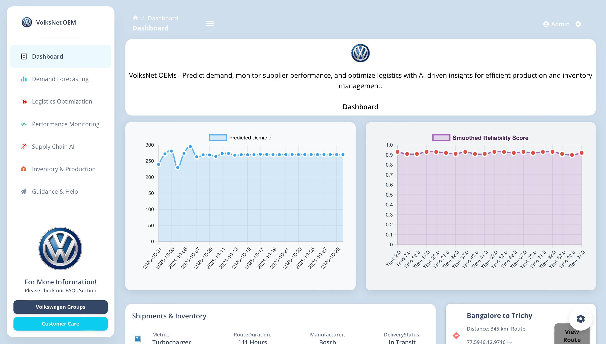
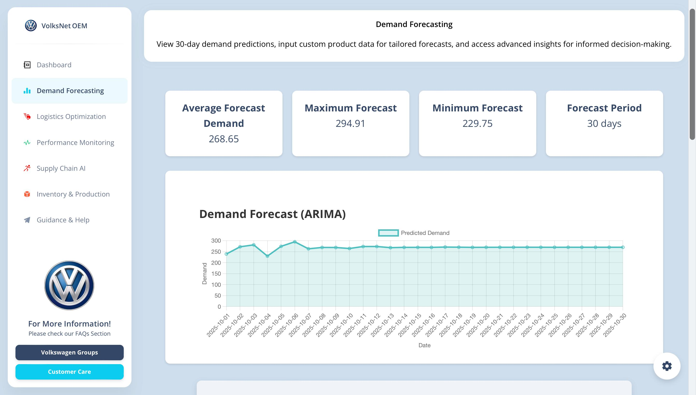
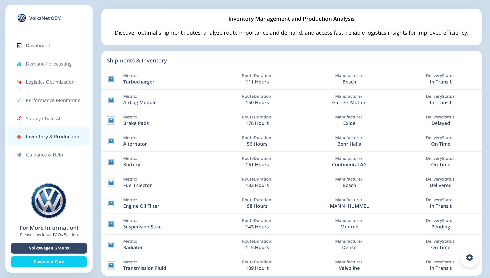
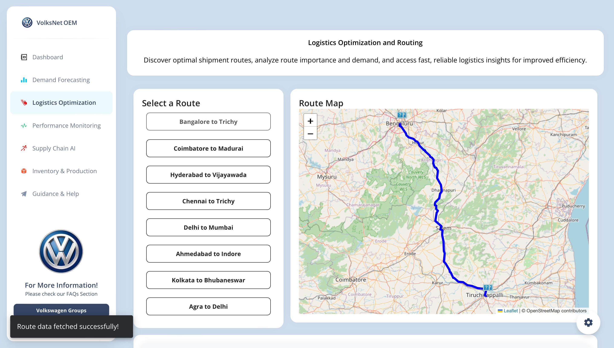
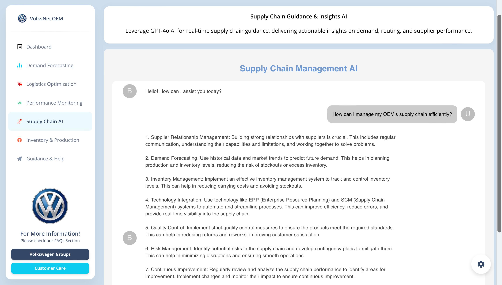
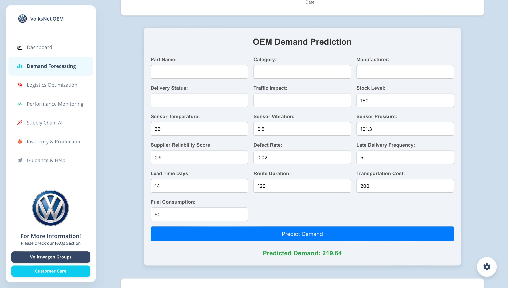
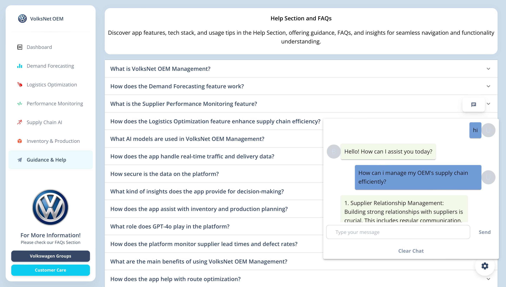
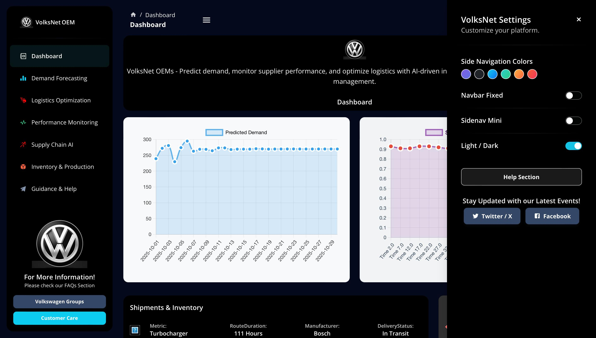

<div align="left">
  
## 🚀 VolksNet OEM Management

**VolksNet OEM Management** is an AI-driven platform tailored for Original Equipment Manufacturers (OEMs) to streamline supply chain operations. By leveraging advanced AI models and real-time data integration, VolksNet offers comprehensive solutions for **demand forecasting**, **supplier performance monitoring**, and **logistics optimization**, helping OEMs tackle industry challenges with ease.

## 🌟 Features

### 1. **Dashboard Overview**
- Centralized view of key metrics like demand trends, supplier reliability, and logistics insights.
- Provides a real-time snapshot, enabling quick, data-driven decisions.

### 2. **Demand Forecasting**
- Uses ARIMA and XGBoost models for accurate time-series forecasting.
- Predicts future demand based on historical data, aiding inventory and production planning.
- Supports custom user inputs for tailored demand predictions.

### 3. **Supplier Performance Monitoring**
- Tracks vital supplier metrics like lead times, defect rates, and overall reliability.
- Sends proactive alerts for underperforming suppliers.
- Helps optimize supplier selection, enhancing supply chain efficiency.

### 4. **Logistics Optimization**
- Integrates real-time traffic data using the OSRM API for dynamic route optimization.
- Recommends efficient delivery routes, reducing costs and improving delivery times.
- Provides insights into fuel consumption and logistics expenses for better operations.

### 5. **Predictive Maintenance**
- Analyzes sensor data (temperature, vibration) to detect early equipment anomalies.
- Uses Random Forest and Isolation Forest models for anomaly detection.
- Prevents unplanned downtime through proactive maintenance alerts.

### 6. **Supply Chain AI with Personalized Insights**
- Natural language query interface for instant answers based on specific OEM data.
- Offers tailored, data-driven recommendations for better decision-making.
- Handles complex queries like demand spikes, supplier issues, and logistics insights.

### 7. **Custom User Input Predictions**
- Enables users to input custom parameters for precise, scenario-based forecasts.
- Adapts to unique business requirements, offering personalized insights.

## 🔍 Tech Stack

- **Frontend:** React, Chart.js, TypeScript
- **Backend:** Node.js, Express, Python (for AI models)
- **AI Models:** ARIMA, XGBoost, Random Forest, Isolation Forest
- **APIs:** OSRM API for real-time routing
- **Database:** MongoDB for scalable data management

## 📂 Project Structure

```bash
volksnet-oem-management/
├── frontend/            # React application
├── backend/             # Node.js & Python backend
├── data/                # Custom OEM dataset
├── models/              # Machine learning models
├── routes/              # API routes
├── public/              # Static assets
└── README.md            # Project documentation
```
# ⚙️ Installation Guide for VolksNet OEM Management

This guide will help you set up the **VolksNet OEM Management** project on your local system. Follow the steps below to get started quickly.

## 🛠️ Prerequisites

Ensure you have the following installed:

- **Node.js** (v14 or later) - [Download Node.js](https://nodejs.org/)
- **Python** (v3.8 or later) - [Download Python](https://www.python.org/downloads/)
- **MongoDB** (Local or Cloud Instance) - [Download MongoDB](https://www.mongodb.com/try/download/community)

## 📦 Step 1: Clone the Repository

Clone the project from GitHub:

```bash
git clone https://github.com/your-username/VolksNet-OEM-Management.git
cd VolksNet-OEM-Management
```
## Step 2: Install All Project Dependencies

### Install Python Dependencies

To install all the necessary Python libraries, use the provided `requirements.txt` file:

```bash
pip install -r requirements.txt
```
Install Node.js Dependencies
Navigate to the frontend and backend directories to install Node.js packages:

```bash
Copy code
# Install frontend dependencies
cd frontend
npm install

# Install backend dependencies
cd ../backend
npm install
This installs all required packages for both the frontend (React) and backend (Node.js).
```
## Step 3: Configure Environment Variables
Copy Example Environment Files
To set up the environment variables, copy the example .env files:

```
# Frontend environment setup
cp frontend/.env.example frontend/.env

# Backend environment setup
cp backend/.env.example backend/.env
```
Edit the .env Files
Open the .env files in the frontend and backend directories, and update the variables with your configuration (e.g., MongoDB URI, API keys).


## Step 4: Start the Application
Start the Frontend Server
Navigate to the frontend directory and start the React application:
```
cd frontend
npm start
```
Access the frontend at: http://localhost:3000

Start the Backend Server
Navigate to the backend directory and run the server:
```
Copy code
cd ../backend
npm run dev
```
Access the backend API documentation at: http://localhost:5000/api-docs

## Step 5: Seed the Database (Optional)
To populate the MongoDB database with sample data for testing, run:
```
cd backend
npm run seed
```
This command seeds the database with predefined entries, enabling you to test the application features immediately.

### 🌐 Access the Application
You can now access the application and its features:

Frontend Application: http://localhost:3000
API Documentation: http://localhost:5000/api-docs
### 📸 Screenshots
### Dashboard Overview and Demand Forecasting
<div align="center">
  
  
</div>

### Supplier Performance Monitoring and Logistics Optimization
<div align="center">
  
  
</div>

### Predictive Maintenance and Custom User Input Predictions
<div align="center">
  
  
</div>

### Help Section And Settings
<div align="center">
  
  
</div>

##📜 License
Distributed under the MIT License. See LICENSE.txt for more information.

## 📞 Contact
**Team Members:**
- [Aadithya Ram](https://www.linkedin.com/in/aadiithyyya/)
- [Yasir Tawfiq](https://www.linkedin.com/in/shaik-yasir-tawfiq)
- [Shabnya Kishore](https://www.linkedin.com/in/y-shabanya-kishore-9a7a55249/)
- [Godfrey Ashwanth](https://www.linkedin.com/in/godfrey-ashwanth-34b4121b7/)

**Project Repository:**
- [GitHub: VolksNet OEM Management](https://github.com/Aadithya-4010002/VolksNet-OEM-Management-)
</div>


